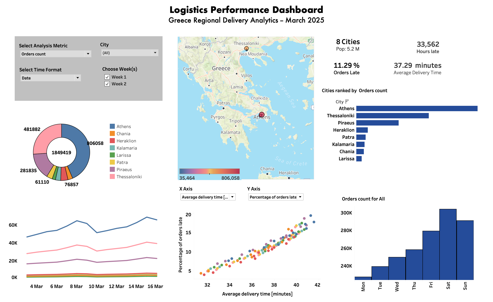

## Logistics Performance Dashboard

An interactive Tableau dashboard exploring delivery performance across eight major Greek cities using a synthetic logistics dataset. The dashboard demonstrates dashboard design, calculated fields, interactive filtering, geospatial visualisation, and business-focused analytics.

### Overview

This project analyses operational delivery performance across multiple Greek cities over a two-week period during March 2025.

The dashboard allows users to interactively explore key operational metrics including order volumes, delivery performance and service reliability through maps, time-series visualisations, scatter plots and ranked comparisons.

The project was built as a demonstration of Tableau dashboard development and business analytics using synthetic operational data.

### Dashboard Features
- Interactive parameter to switch between operational metrics
- City and week filtering
- Geographic visualisation of delivery activity
- KPI summary cards
- Ranked city comparisons
- Time-series trend analysis
- Correlation analysis between delivery time and late deliveries
- Distribution of activity across days of the week

### Metrics

| Metric                          | Description                                                                    |
| ------------------------------- | ------------------------------------------------------------------------------ |
| Orders Count                    | Total number of customer orders                                                |
| Average Delivery Time           | Mean delivery time (minutes)                                                   |
| Percentage of Orders Late       | Percentage of deliveries exceeding the service threshold                       |
| Orders per 1000 Population      | Normalised order volume to enable comparison between cities of different sizes |
| Late Orders Count               | Estimated number of late deliveries                                            |
| Late Orders per 1000 Population | Normalised late deliveries accounting for population differences               |
| Total Hours Delayed             | Estimated cumulative delivery delay across all late orders                     |

**Orders per 1000 Population**

    1000 × Orders Count / Population

Normalises order volume to enable fairer comparisons between cities of different sizes.

**Late Orders Count**

    Orders Count × Percentage of Orders Late / 100

Calculates the estimated number of late deliveries.

**Late Orders per 1000 Population**

    Late Orders Count × 1000 / Population

Normalises late deliveries by city population to reduce the influence of larger metropolitan areas.

**Total Hours Delayed**

    ((Late Orders Count × (Average Delivery Time − 30)) / 60)

Estimates cumulative delivery delay assuming deliveries exceeding 30 minutes are considered late (see below).

### Key Insights
**Demand increased over time**

Operational activity increased steadily across the two-week analysis period, with order volumes and related operational metrics generally trending upwards.

**Larger cities dominate operational workload**

Athens and Thessaloniki account for a substantial proportion of overall delivery activity. Larger metropolitan areas naturally generate higher absolute numbers of late deliveries due to significantly greater order volumes.

**Weekly operational cycle**

Monday consistently demonstrates the strongest delivery performance, while activity and operational pressure build progressively throughout the week, peaking on Saturday before easing on Sunday.

**Delivery time strongly predicts lateness**

There is a strong correlation between the *Average Delivery Time* and the *Percentage of  Orders Late* (p-value = 4.6 x 10-69), which is indicative of an operational bottleneck – as the delivery increases the system’s ability to absorb delays decreases.  

Possible causes include:

- Traffic conditions and other external disruptions
- High orders during peak periods
- Operational bottlenecks, e.g. reactive planning, long dwell times

Also, from a linear fit, the intercept occurs at approximately 30 minutes, suggesting that orders are considered late after this time. This is used to calculate the *Total Hours Delayed*

### Technologies Used
- Tableau Desktop
- Tableau Calculated Fields
- Tableau Parameters
- Tableau Dashboard Actions
- Geographic Mapping
- Python
- Git
- Pandas

### Data

The synthetic dataset (WEEKLY_ORDERS.xlsx) is processed using a Python data pipeline to:

- Clean and validate the data
- Perform exploratory data analysis
- Prepare fields for Tableau visualisation
- Generate calculated metrics
- Add geospatial coordinates for mapping

### Future Improvements

Potential enhancements include:

- Integration with live operational data
- Driver-level performance analysis
- Weather and traffic enrichment
- Predictive modelling of late deliveries
- Interactive forecasting
- Operational SLA monitoring

### Skills Demonstrated
- Business Intelligence
- Tableau Dashboard Development
- Interactive Data Visualisation
- KPI Design
- Geospatial Analytics
- Dashboard UX
- Data Storytelling
- Business Analytics
- Calculated Fields
- Parameter-Driven Dashboards
- Data Engineering (lightweight ETL)
- Statistical Analysis
- Exploratory Data Analysis (EDA)

### Author

**Steve Curran**

Principal Data Scientist | AI & Analytics | Tableau | Python 

**Note**

This project uses a synthetic dataset generated for portfolio and educational purposes. The analysis demonstrates dashboard design, interactive analytics and data storytelling rather than real operational performance.
